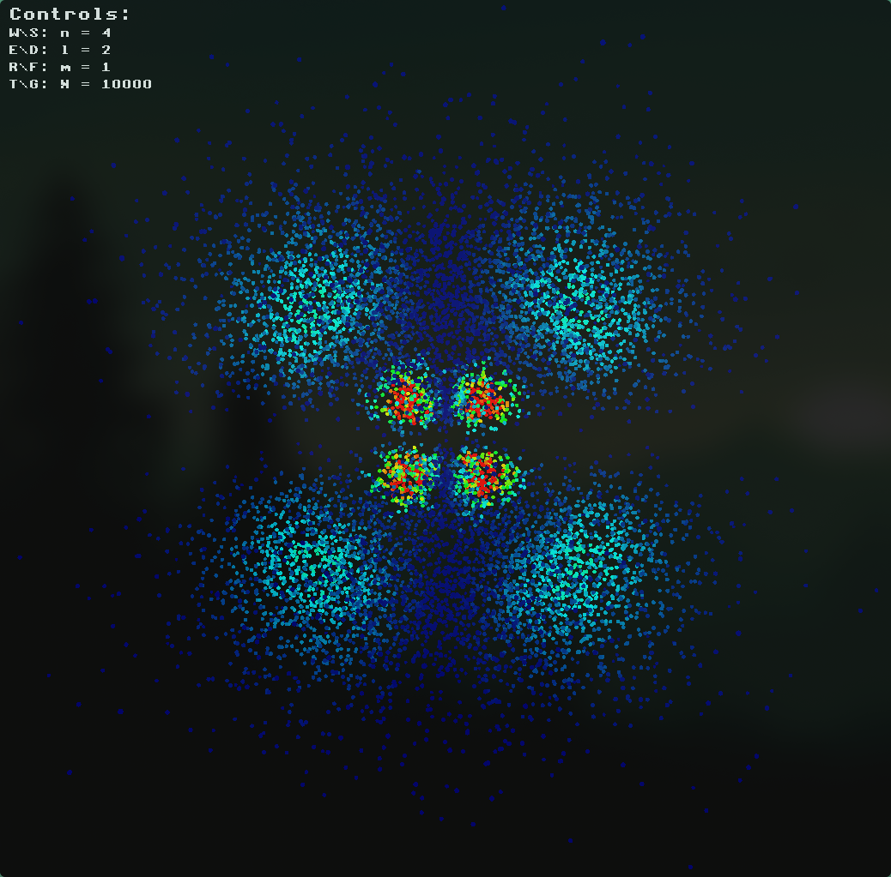

Atomic Orbital Simulator
========================

A real-time atomic orbital visualization and simulation project built with modern OpenGL.\
The application renders quantum orbital probability distributions in 3D using particle-based sampling techniques.

## Preview



Features
--------

-   Real-time 3D orbital visualization
-   Support for configurable quantum numbers:
    -   Principal quantum number `n`
    -   Azimuthal quantum number `l`
    -   Magnetic quantum number `m`
-   OpenGL-based rendering pipeline
-   Camera controls and interactive navigation
-   Particle sampling of electron probability density
-   Cross-platform CMake build system

Technologies Used
-----------------

-   C++
-   OpenGL
-   GLFW
-   GLM
-   GLAD
-   CMake

Build Instructions
------------------

### Requirements

Install the following dependencies:

-   CMake (3.16 or newer)
-   C++17 compatible compiler
-   OpenGL development libraries

### Clone Repository

```
git clone <your-repository-url>cd <project-folder> --recursive
```

### Build

```
mkdir buildcd buildcmake ..cmake --build .
```

### Run

```
./Atoms
```

> On Windows, the executable may be located inside the generated build configuration folder (e.g. `Debug/` or `Release/`).

Controls
--------

| Key / Input | Action |
| --- | --- |
| Mouse | Rotate camera |
| WASD | Change Orbitals |
| Scroll | Zoom |
| ESC | Exit application |

Orbital Visualization
---------------------

The simulator generates electron probability distributions using sampled quantum wavefunctions derived from hydrogen-like atomic orbitals.

Different `(n, l, m)` configurations produce distinct spatial orbital shapes such as:

-   s orbitals
-   p orbitals
-   d orbitals
-   f orbitals

License
-------

This project is licensed under the MIT License.
